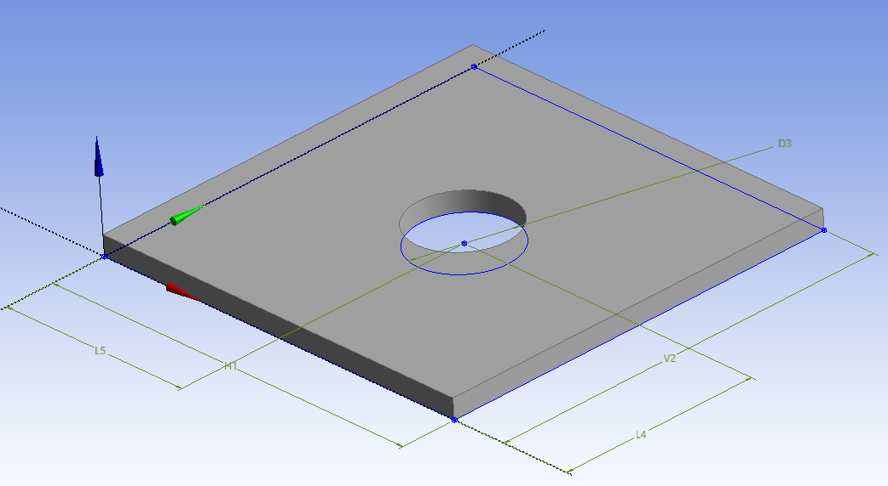
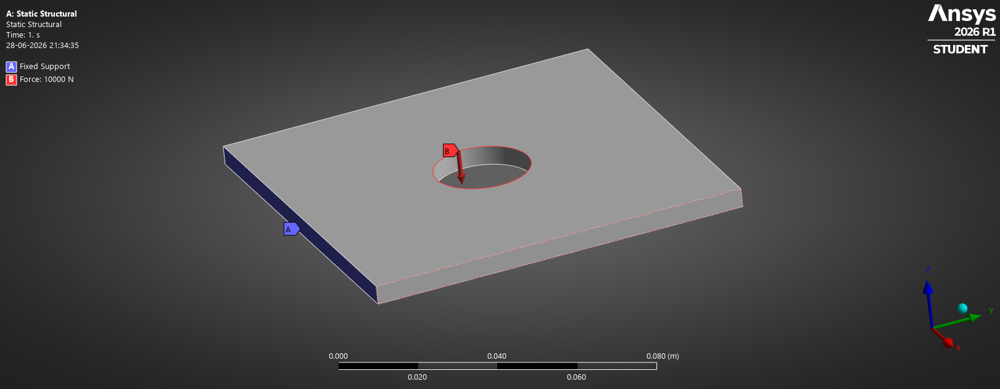
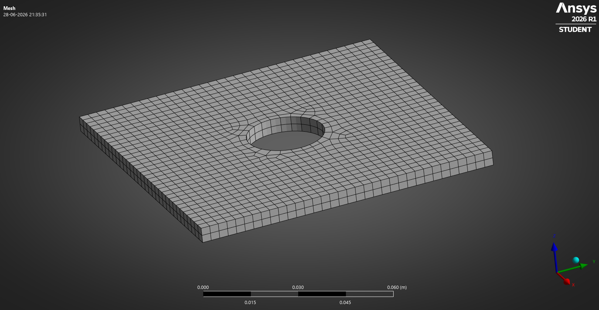
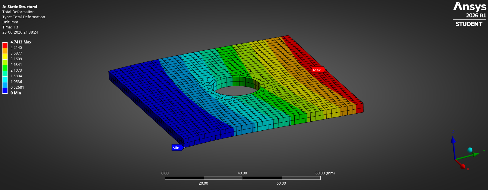
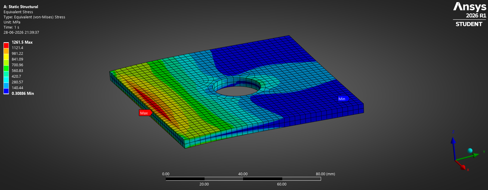

# Plate with Hole — Linear Static Structural Analysis

## Objective

Study the stress concentration developed around a circular hole in a plate subjected to tensile loading.

---

## Geometry

---

## Boundary Conditions

---

## Mesh

---

## Total Deformation

---

## Equivalent Stress (Von Mises)

---

## Learning Outcomes

* Introduction to linear static structural analysis.
* Understanding stress concentration effects.
* Application of boundary conditions.
* Mesh generation and refinement.
* Interpretation of deformation and stress contours.

---

## Software

* ANSYS Workbench
* DesignModeler

## Analysis Type

* Linear Static Structural Analysis
