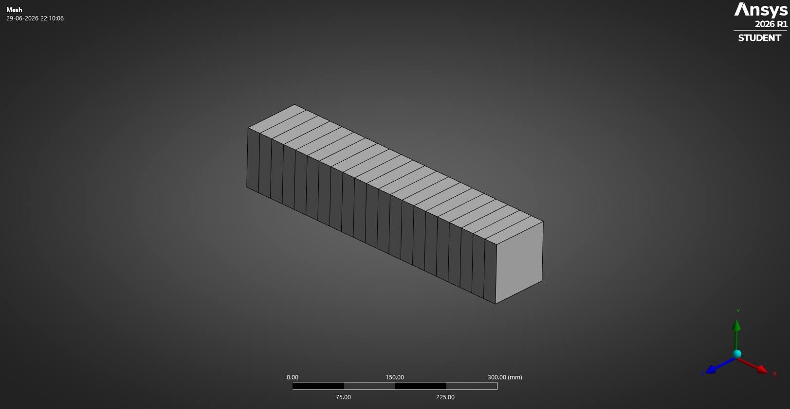
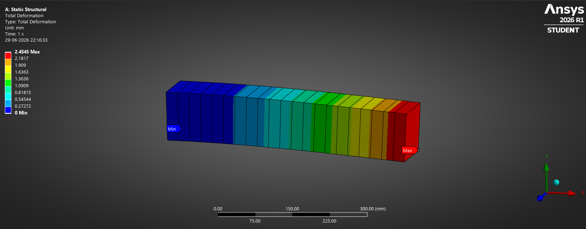

# Beam Analysis using 1D Beam Elements

## Objective

Study the behavior of beam elements under axial and bending loads using 1D beam elements in ANSYS Workbench.

---

# Axial Loading Case

## Geometry

---

## Boundary Conditions

---

## Mesh

---

## Total Deformation

---

## Equivalent Stress (Von Mises)

---

# Bending Case

## Geometry

---

## Boundary Conditions

---

## Mesh

---

## Total Deformation

---

## Equivalent Stress (Von Mises)

---

## Learning Outcomes

* Introduction to 1D beam elements in FEA.
* Understanding axial deformation behavior.
* Understanding bending behavior of beam structures.
* Application of boundary conditions and loading.
* Efficient modeling of slender structures using beam elements.
* Interpretation of deformation and stress results.

---

## Software

* ANSYS Workbench
* DesignModeler

## Analysis Type

* Linear Static Structural Analysis
* Beam Element Analysis