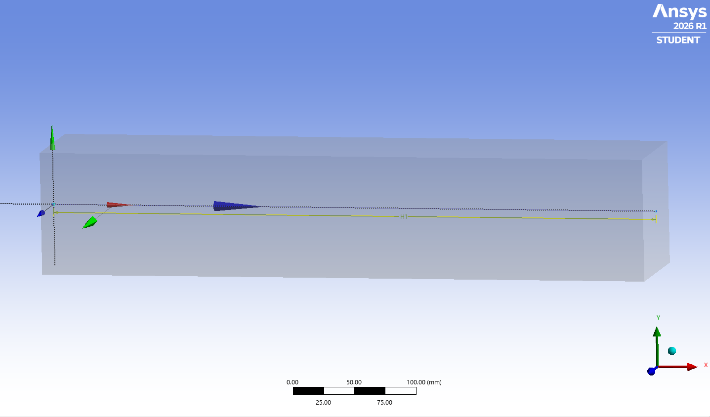
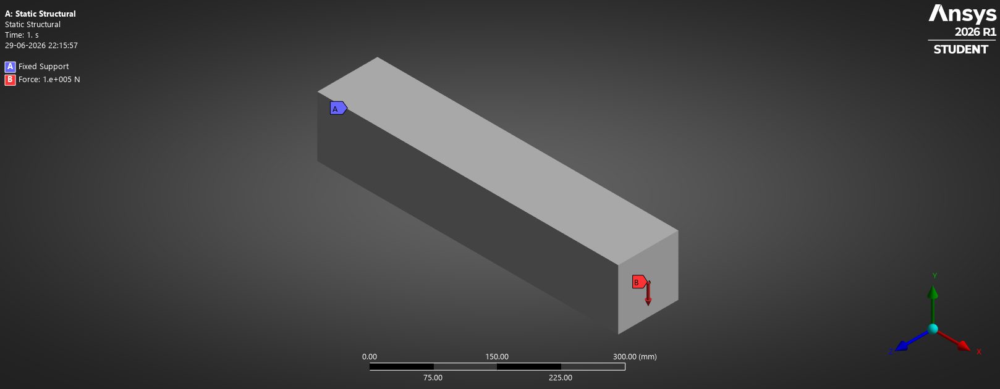
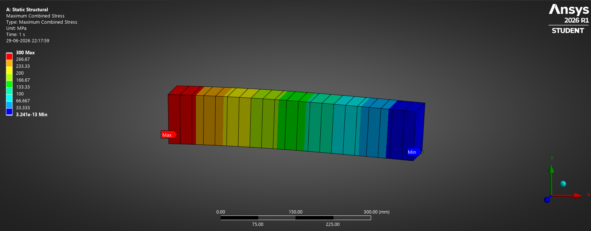

# Beam Analysis

This project covers the use of 1D beam elements in ANSYS Workbench.

## Cases Covered

### Axial Loading

- Geometry creation
- Boundary condition application
- Axial deformation
- Stress distribution

---

### Bending

- Beam bending behaviour
- Deflection calculation
- Bending stress distribution

