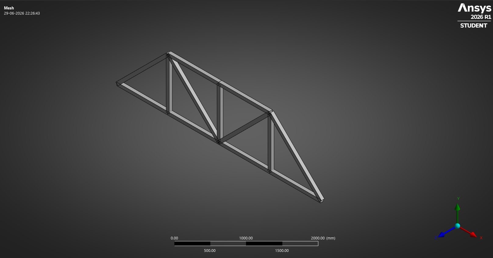

# Truss Analysis — Linear Static Structural Analysis

## Objective

Study the structural response of a truss subjected to external loading and understand load transfer through axial members using truss elements in ANSYS Workbench.

---

## Geometry

---

## Boundary Conditions

---

## Mesh

---

## Total Deformation

---

## Equivalent Stress (Von Mises)

---

## Learning Outcomes

* Introduction to truss elements in finite element analysis.
* Understanding load transfer through axial members.
* Application of structural supports and loading conditions.
* Interpretation of deformation and stress contours.
* Understanding the behavior of pin-jointed structures.

---

## Software

* ANSYS Workbench
* DesignModeler

## Analysis Type

* Linear Static Structural Analysis
* Truss Element Analysis