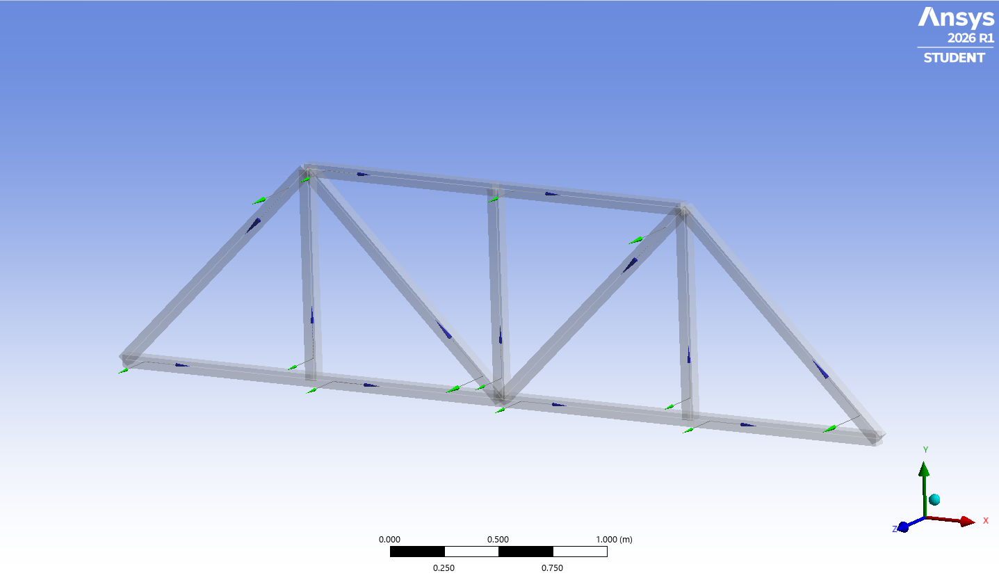
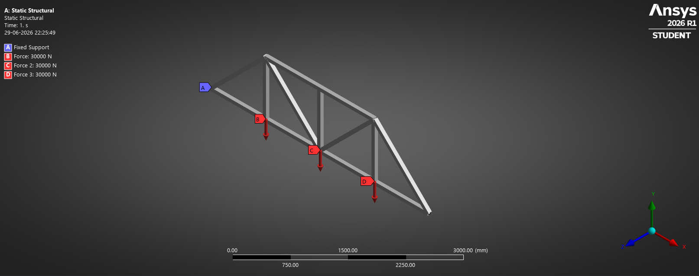
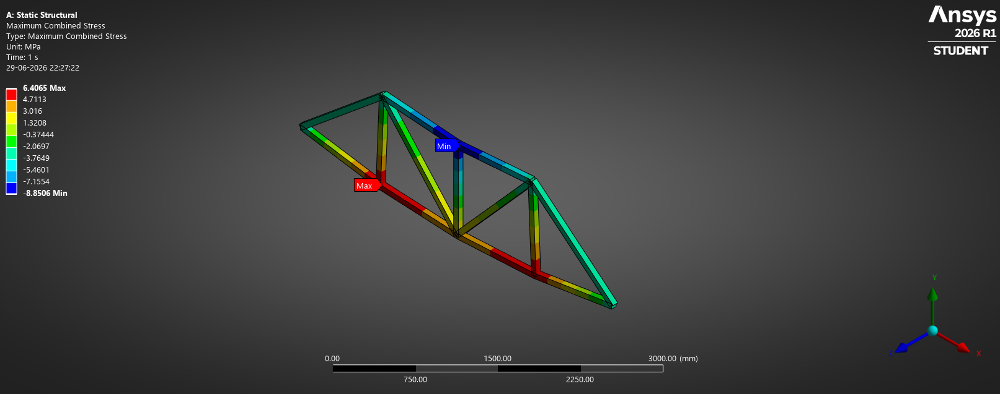
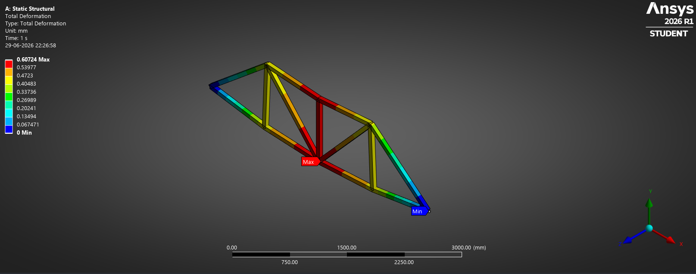

# Truss Analysis

Structural analysis of a truss using truss elements.

## Learning Outcomes

- Force transfer through members
- Axial stress in truss members
- Structural deformation
- Boundary condition application

## Results

### Geometry

### Boundary Conditions

### Stress Distribution

### Deformation

