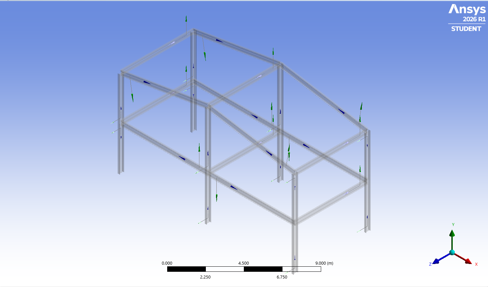
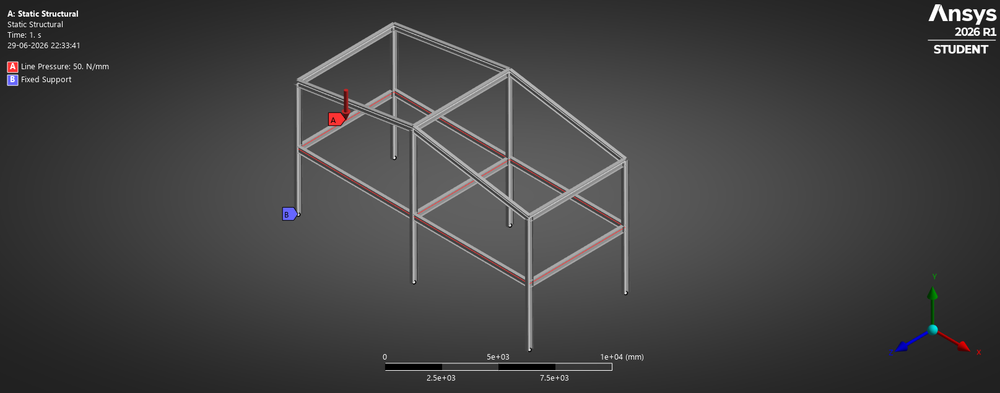
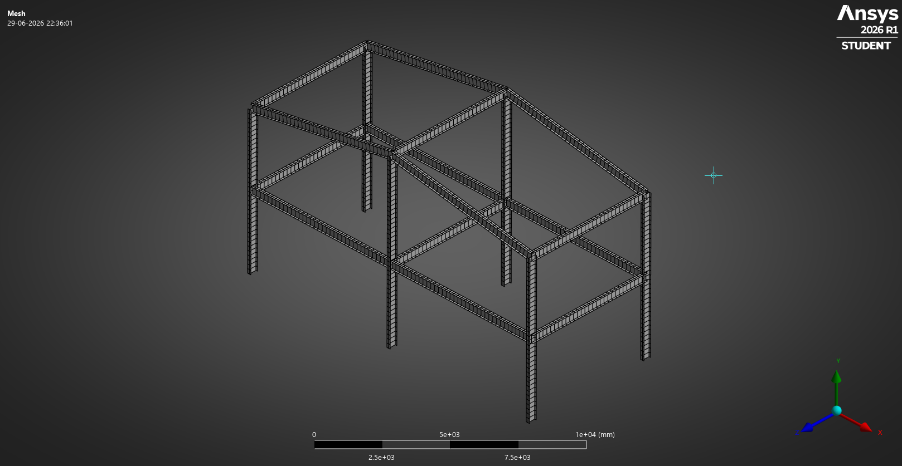
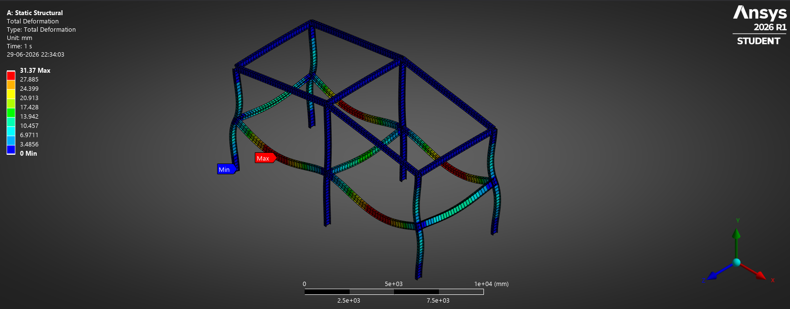
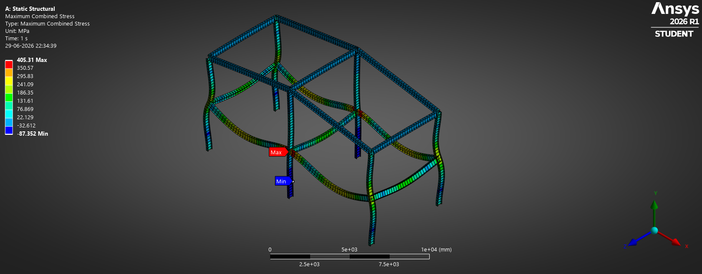

# Steel Frame Analysis — Linear Static Structural Analysis

## Objective

Study the structural behavior of a steel frame subjected to external loading and understand load transfer, deformation, and stress distribution in frame members using beam elements in ANSYS Workbench.

---

## Geometry

---

## Boundary Conditions

---

## Mesh

---

## Total Deformation

---

## Equivalent Stress (Von Mises)

---

## Learning Outcomes

* Introduction to frame analysis using beam elements.
* Understanding load transfer in framed structures.
* Application of supports and loading conditions.
* Interpretation of deformation and stress contours.
* Understanding combined axial and bending behavior in frame members.

---

## Software

* ANSYS Workbench
* DesignModeler

## Analysis Type

* Linear Static Structural Analysis
* Beam Element Analysis